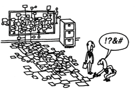
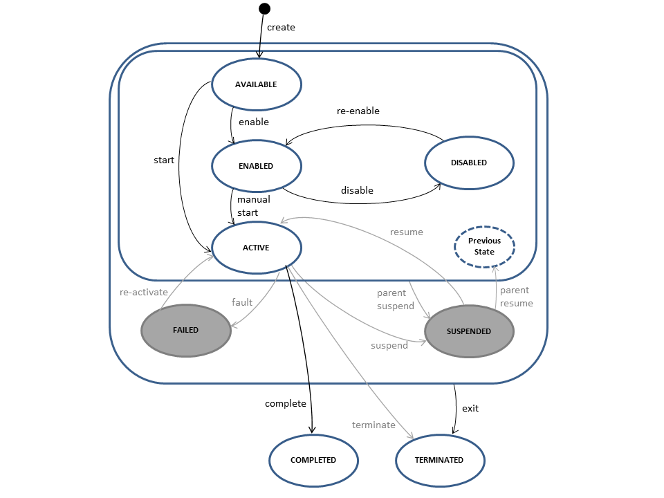

# Dealing with surprise

Case Management using BPMN

--v

--->

## About me

Holisticon AG

* https://github.com/jangalinski
* https://twitter.com/jangalinski

--->

# Intro

--v

## BPMN

* Strongly structured processes

## CMMN

* weakly structurd processes

--v

## Key element: Surprise

* things can happen while we are doing other things
* we must be able to go back and do stuff again

--v

or

## Bernds Domina

--->

# The business

--v

## Our (simplified) Dept recovery process

<small>
* When a new dept is imported we must send a 'hello'-letter to the deptor
* After the letter was received, we might choose to remind him via telephone or mail.
* Telephone is only possible if we have a valid phone number. 
* Mail is only possible if we have a valid address.
* Due to german law, we must not try to call more than 3 times a day with a minumum of 2h between tries.
* It's company policy not to call on holidays or weekend.
* If we choose to send out a mail, we have to give the deptor a decent grace period to respond, no actions are allowed during this period.
* When the dept is paid, we send a 'goodby'-letter and close the case. 

</small>

--v

## Let here be a really ugly BPMN process

--v

## Let here be a really nice CMMN model

--->

# Four years ago ...

we would have stopped here. CMMN to the rescue

--v

## Flaws of CMMN Specification

* Repetition - when? how? - example
* Manual Start - when? how? - example

--v

## Flaws of engine implementation

* Optimistic locking due to everything happening at once
* no timers
* no events
* no milestones
* ...
* no further development

--->

# CMMN Core

--->

## What next?

* support more cmmn features with lib
* provide modeler templates to select patterns
* provide cockpit plugin to visualize the state of activities

--->

# Der rote Faden

--->

## Abstract 

Real life does not follow strict plans (aka strongly structured business processes),
it is full of change and driven by events. Case Management with CMMN would have been
a solution, but the standard never really took off and tool support is lacking. 
In this presentation we will investigate patterns of weakly structured processes and learn
how our well known BPMN can be used to handle surprise.